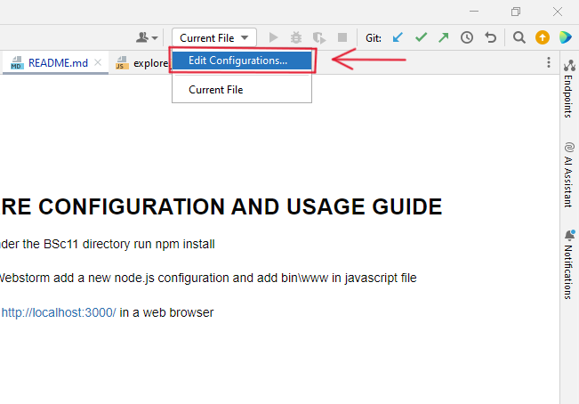
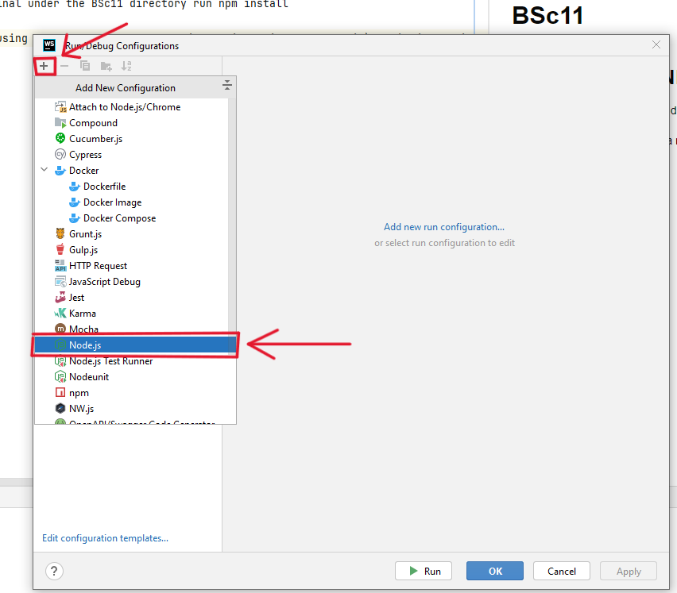
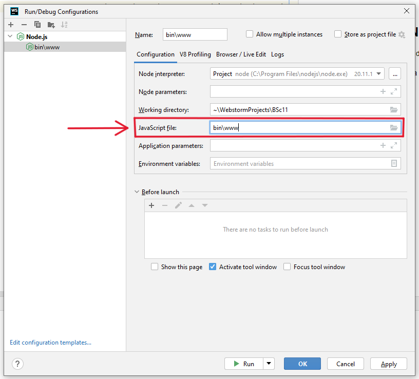

# BSc11
The GitHub repository can be found at this link https://github.com/quinny1274/BSc11.

The video demonstrating the web app can be found at this link https://drive.google.com/file/d/1oN4ER8x_-w56R3kpKmiIJyozHDjZQwNe/view?usp=sharing
## SOFTWARE CONFIGURATION AND USAGE GUIDE
In the terminal under the BSc11 directory run npm install 

Open MongoDB and connect to it.

If you are using Webstorm add a new node.js configuration and add bin\www in javascript file

Then navigate to http://localhost:3000/ in a web browser
